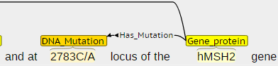
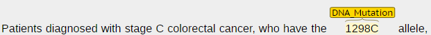
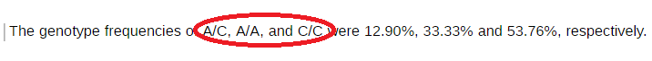
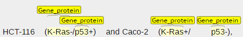
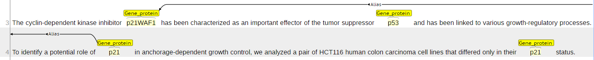

Mutation Annotation Guidelines
==============================

Motivation and scope
--------------------

This document describes the annotation of genetic variants for
colorectal cancer use cases. Annotations are focused on human mutations,
thus no other species are considered in this document.

In a separate document, normalization of mentions will be specified. For
instance, mentions like *BRAF mutation* and *BRAF mutations* should be
normalized to the same entity (e.g. *BRAF mutation*) so the user
interface in WDD can show a single entry for the same entity.

Furthermore, this document specifies how to annotation of mutation and
related entities should be performed. The information provided by
automatic information extraction methods that are able to automatically
annotate the scientific literature needs to be integrated into WDD and
several strategies might be possible but still require further
discussion.

Entities
--------

All mentions of entities of interest need to be annotated, even when
they are not related to a mutation. For instance, all mentions of
mutations in the abstract need to be identified by the annotators, this
includes related entities as genes (WDD already annotates gene/protein
entities and the annotated entities by WDD will be compared to the
generated ground truth). In addition to mutations, DNA modifications
that are not mutations will be annotated as well due to their relevance
to drug discovery.

The BRAT window in which the entities that annotators can select are
displayed is shown below. These entities are described in more detailed
in the following subsections.

 

As a general rule, general mentions of entities such as “gene” or
“locus” should not be annotated. This is does not apply to the entity
type mutation, e.g. terms such as mutation or mutations still need to be
annotated as indicated below.

Occasionally, the boundaries of an entity might be in the middle of another word, e.g. in the example below probably a hyphen would have needed to be there.

 

### `Gene_protein`

Genes and proteins will be annotated using the same label
`Gene_protein`, since the context of the abstract makes it difficult in
some cases to make the distinction between a gene and a protein.
Examples of protein and gene names: e-cadherin, B-raf, BRAF

[NCBI gene](<https://www.ncbi.nlm.nih.gov/gene>) and 
[UniProt](<http://www.uniprot.org>) can be considered as resources for additional
information about genes and proteins.

Protein families should not be annotated, e.g. "Wnt family".

The `Gene_protein` mention has to match a specific gene or protein in itself. In the following example, it refers to a specific type of antibody. A mention of the "epidermal growth factor receptor" or "EGFR" should be annotated.

RNA
---

Mutations can be identified as well in RNAs (ribonucleic acid) and need
to be annotated as an entity. This entity type includes micro-RNAs

Locus
-----

Position on a chromosome or protein, where mutations may be identified. A locus is
not a type of mutation but a position on a chromosome. Example:

 

There are complex examples in which loci and mutation information might
appear in complex nomenclature. In the examples below, the mutations and
loci are annotated and related. Loci can be decomposed in multiple
components. Due to the structure definition, complex loci can be
decomposed a posteriori and the level of detail for this annotation
effort should be kept as simple as possible.

 

 

When locus appears as a compound noun that refers to a region, it should
be annotated as one entity.

 

In an example such as "codons 12 and in some cases 16 as well", the locus entity would be "codons 12 and in some cases 16".

### Mutation 

Mentions of in text are complex and can be represented in different ways
and convey different types of information. The 
[definition of mutation on Wikipedia](https://en.wikipedia.org/wiki/Mutation) may be helpful.
A definition of what a mutation is seems to be quite complex, the definition of the mutation entity covered in this document covers genetic mutations and genetic variants (e.g. SNPs), without making an explicit distinction between them.

Mutations have been categorized according to DNA, RNA or protein mutations and the most
specific annotation should be selected. If it is not possible to
identify which kind of biological entity the mutation took place in, the
generic type `mutation` should be used.

Mutation entity types covers structured mutations in which the changes
in a sequence are defined to broader mentions that only describe that
there was a mutation in a gene (e.g. “BRAF mutation”). Depending on the
information contained in the mutation, different normalizations will be
defined in a separate document.

#### Examples of DNA\_Mutation/RNA\_Mutation/Protein Mutation

Mutations may appear in text following the HGVS nomenclature. Check HGVS
structure for types and subtypes of mutations
(See [HGVS guidelines](http://varnomen.hgvs.org) for a reference). Mutations can be
identified as protein, RNA and DNA mutations.

 

In some cases, authors might not be compliant with HGVS nomenclature. An
example is shown below, in which both DNA mutations follow the
nomenclature for substitutions in proteins.

 

The example below shows another case of a DNA mutation that does not
follow the HGVS nomenclature but it indicates the sequence change that
took place in the gene.

In cases where the author is not compliant, the attribute `NonStandard` should be checked.

 

Furthermore, generic terms such as “mutation” might appear in together
with other mentions of more specific mutations, as shown above. For
consistency, all mentions should be annotated as shown in the examples
below.

 

Definition of mutations is complex and we would like to capture all possible mutation mentions.
Terms denoting genomic variants such as "SNPs" or "polymporphisms" should be annotated as well. 

 

 

Terms denoting mentions of a missing gene such as “lack” or “loss”
should be annotated. Mentions of consequences related to having a
mutation such as “overexpressed” or “underexpressed” should not be
annotated.

 

 

When a full natural language phrase is used to describe the mutation,
the word or short phrase (as short as possible) from the text which most
strongly indicates that a mutation has occurred should be annotated, as
shown in the examples below.

 

 

Other mutations may indicate a sequence change using natural language,
which otherwise would have been specified in structured format. Probably
requires a normalization step into HGVS format during ingestion to
cluster together mutation mentions indicating the same sequence change.

Specific changes in gene, protein or RNA sequence might not be specified
in an article but it might mention that a change in the structure of a
gene/protein/RNA took place, e.g. 

> BRAF mutations

From the example, it
can be deduced that BRAF has been mutated but it is not possible to
identify the change that took place in its structure.
In this case “BRAF” is annotated a gene and
“mutations” as mutation, and both entities would be related.

 

In general the annotated entities, including mutations, should include
all relevant information but no more as part of the annotation. In the
example below the whole term “reciprocal translocation” needs to be
annotated instead of just “translocation”.

 

In the example below, term allele is a descriptor with no mutation
information and should not be included in the annotation of a mutation.

 

“[Microsatellite
stability](<https://en.wikipedia.org/wiki/Microsatellite_instability>)”
should be annotated as mutation, even though unlikely to be linked to specific genes.
“Mismatch repair” (MMR) should not be annotated.

 

### What not to annotate as mutation

Genotype mentions are abstract, even if these mentions include the term
“mutation”, they should not be annotated.

In the example below, only the term mutation should be annotated:

 

The mentions of A/C, A/A and C/C in the example below denote genotypes
and should not be considered as mutations.

 

Mentions of consequences related to having a mutation such as
“overexpressed” or “underexpressed” should not be annotated.

Mentions of germline (or germ-line) mutations, should be annotated simply as mutation.

Cell line descriptions should not be annotated. If genes are mentioned, these should be annotated as in the example below.

#### dbSNP ids

dbSNP[^1] is a public archive for genetic variation across species.
Authors in papers might refer to single nucleotide polymorphisms using
dbSNP identifiers. These identifiers are typically of the form
rs\[0-9\]+.

 

### `DNA_modification`

In addition to mutations, there are other non-sequence-altering changes that may produce
over/under expression of a gene product.
Mentions of these changes in text should be annotated as DNA modifications.
Examples include epigenetic
alterations. Identifying DNA modifications supports the understanding of
factors that affect gene expression. This information is currently not
considered in the WDD system and conversations are required to make this
information available to WDD users.

 

It is very rare, but in some occasions it might be unclear if an entity indicates if there is a sequence-altering change or not, as in the example below.
If it is not clear that it is a sequence-altering change, the entity should be annotated as modification.

Relations
---------

### `Has_mutation`

Annotate relation between `Gene_protein`/`RNA`/`locus` entities and `mutation`
entities when they appear in the same sentence. Since the types of entities can
be recovered, specific types of relations can be derived to prepare and
evaluate natural language processing methods.

 

It not necessary to link mutation to gene when it is linked via a `locus` -> `component_of` relationship.

### `Has_modification`

Annotate relation between `gene_protein` and `DNA_modification` when they appear in
the same sentence.

 

### `Component_of`

Annotate relations between a `locus` that is a component of a gene. This
is important since the mutations might be specified with respect to a
given locus, while WDD needs to know which gene is affected by the
mutation. An example is available below.

 

### `Alias`

Relate entities that have the same meaning (e.g. p21WAF1 and p21 in the
example below). Annotate the first mention in the abstract even if it is
cross sentence. The closest prior or post reference is annotated.

There may be cases in which alias relations is made between a generic name and a specific name of gene/protein.

